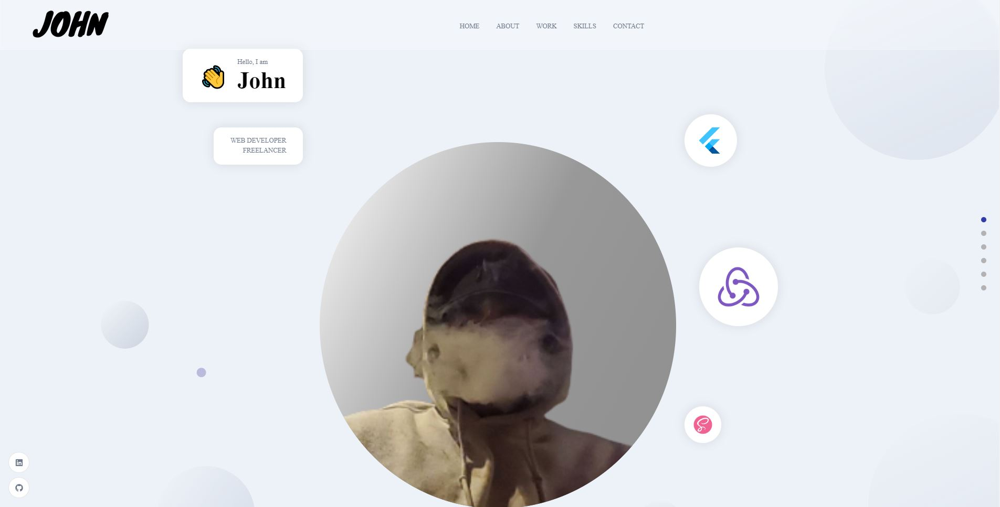

<a href="https://johnandres.dev/"><h1><b>John's Portfolio</b></h1></a>

<button><a href="https://johnandres.dev/">Check out the project</a></button>

<h2>Tech used</h2>

- <b>[React](https://reactjs.org/)</b>: A Javascript front-end library for building User Interface (UI).
- <b>[Mui](https://mui.com/)</b>: UI tool with production-ready components.
- <b>[SASS](https://sass-lang.com/)</b>: CSS with superpowers
- <b>[Email JS](https://www.emailjs.com/)</b>: Send Contact form data to my email with out server
- <b>[Framer Motion](https://www.framer.com/motion/)</b>: A production-ready motion library for React.
- <b>[React Icons](https://react-icons.github.io/react-icons/)</b>: A Collection of popular icons made for react
- <b>[Sanity](https://www.sanity.io/)</b>: CMS API to CRUD my portfolio

## MADE WITH ❤️ BY

<td align="center"><a href="https://github.com/John4E656F"> <b>John Andres</b></a> <a href="https://github.com/John4E656F3" title="Code">💻</a> </td>

### Don't Forget to Leave a Follow 👍 & Star ⭐

### It only takes Two Second to ⭐

